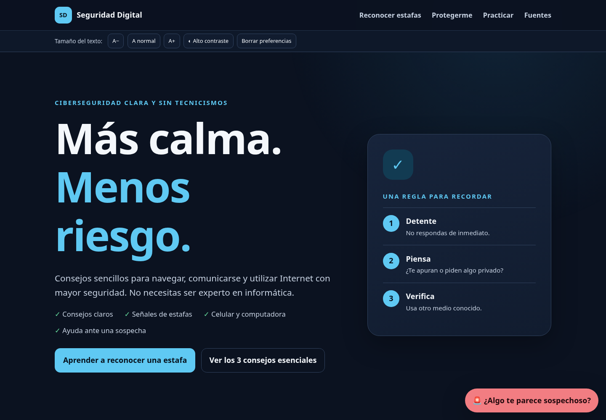

# Seguridad Digital

Sitio educativo, gratuito y accesible para aprender a reconocer estafas, proteger cuentas y usar Internet con mayor seguridad. Está pensado especialmente para adultos mayores, familiares, cuidadores y personas con conocimientos tecnológicos básicos.

> **Detente → Piensa → Verifica**



## Demo

[Abrir Seguridad Digital](https://martnmartnez14.github.io/cyberseguridad-mayores/)

## Características

- Consejos breves sin jerga innecesaria.
- Detector educativo de señales de estafa.
- Semáforo digital y ejemplos prácticos.
- Simulador ficticio de phishing.
- Mapa conceptual accesible, con alternativa como lista.
- Quiz de ocho situaciones con explicaciones.
- Buscador local.
- Controles de tamaño de texto y alto contraste.
- Tema claro, oscuro y automático según el dispositivo.
- Panel de ayuda urgente.
- Sin cuentas, analítica ni recolección de datos personales.

## Tecnologías

HTML5 semántico, CSS3, SVG y JavaScript vanilla. No requiere framework, proceso de compilación ni servidor.

## Uso local

Puedes abrir `index.html` directamente. Para reproducir el entorno de publicación:

```bash
python3 -m http.server 8000
```

Luego visita `http://localhost:8000`.

## Estructura

```text
├── index.html
├── css/
│   ├── style.css
│   └── accessibility.css
├── js/
│   ├── app.js
│   ├── scam-checker.js
│   ├── quiz.js
│   └── graph.js
├── assets/
└── docs/SOURCES.md
```

## Accesibilidad

El sitio usa HTML semántico, foco visible, controles grandes, navegación mediante teclado, texto base de 18 px, contraste revisado, alternativa textual del mapa y respeto por `prefers-reduced-motion`. Incluye tema claro y oscuro (con opción automática), modo de alto contraste y anuncios para lectores de pantalla en el cuestionario. La información esencial permanece disponible si JavaScript falla.

## Fuentes

Las recomendaciones principales se basan en CISA, NCSC e INTERPOL. Consulta la [trazabilidad completa](docs/SOURCES.md).

## Privacidad

No se usan rastreadores, publicidad ni cookies de seguimiento. `localStorage` conserva únicamente las preferencias de accesibilidad (tamaño de texto, contraste y tema) y la finalización del quiz. El usuario puede borrar esos datos desde la propia web.

## Roadmap

### v1.0

- Página educativa, phishing, llamadas, WhatsApp, contraseñas y 2FA.
- Semáforo, detector educativo, quiz, accesibilidad y mapa conceptual.

### v1.1

- PWA y contenido offline.
- Más escenarios y mejoras de accesibilidad.

### v2.0

- Versiones en portugués e inglés.
- Contenido y contactos específicos por país.
- Simuladores adicionales.

## Contribuciones

Las contribuciones son bienvenidas. Antes de proponer contenido, verifica que provenga de una fuente oficial, siga vigente, sea comprensible y explique una acción concreta sin culpabilizar a las víctimas.

## Licencia

[MIT](LICENSE).

## Autor

Martín Martínez García.

## ☕ Apoyar el proyecto

¿Te gustó el proyecto? Si quieres colaborar voluntariamente, puedes invitarme a un cafecito o mate:

- [Ko-fi](https://ko-fi.com/martinmartinezgarcia)
- [PayPal](https://www.paypal.com/paypalme/blufferedtwitch)
- [Internet satelital Starlink](https://starlink.com/?referral=RC-DF-5848974-78640-68&app_source=share&utm_source=chatgpt.com) — enlace de afiliado; puede ofrecerte el primer mes según las condiciones de Starlink.
